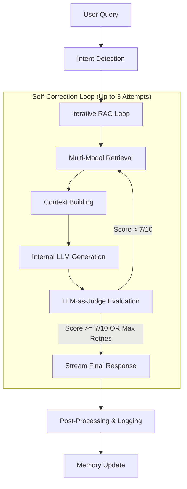

# MemGraph Architecture: Self-Correcting Hybrid RAG

MemGraph is an advanced RAG (Retrieval-Augmented Generation) system designed for high-precision document intelligence. Unlike traditional "one-shot" RAG, MemGraph utilizes an **Iterative Self-Correction Loop** powered by an internal "LLM-as-Judge" to guarantee response quality.

---

## 1. High-Level Process Flow

The MemGraph pipeline follows a sophisticated multi-stage workflow for every user query:

---

## 2. Core Components

### A. The Iterative RAG Loop (The "Self-Corrector")
This is the flagship feature of MemGraph. Most RAG systems retrieve once and hope for the best. MemGraph:
1. Generates an internal answer.
2. Hands it to an independent **Judge LLM**.
3. Evaluates across 4 metrics: **Faithfulness**, **Relevance**, **Completeness**, and **Coherence**.
4. If the overall score is below **7/10**, it triggers a **Self-Correction** cycle, re-performing retrieval with the feedback in mind.

### B. Hybrid Retrieval Engine
MemGraph retrieves context from multiple "modalities" to ensure nothing is missed:
- **Vector Search (Semantic)**: Finds relevant paragraphs using Cohere `embed-english-v3.0`.
- **Table Extraction**: Specifically identifies and retrieves structured data from PDF tables.
- **Intent-Aware Routing**: Detects if the user is asking a new question, a follow-up, or just greeting the system, adjusting the retrieval depth accordingly.

### C. LLM Strategy (Cohere Powered)
The system uses a tiered model approach for optimal performance/cost/quality:
- **Quality Model**: `command-r-plus-08-2024` — Used for final response generation and complex reasoning.
- **Fast Model**: `command-r-08-2024` — Used for low-latency tasks like Intent Detection and Judge evaluation.
- **Embeddings**: `embed-english-v3.0` — Industry-leading retrieval model.

### D. Knowledge Graph Memory (Context Retention)
MemGraph replaces traditional textual summarization with a dynamic **Knowledge Graph Memory** system. Instead of merely compressing past messages, the system:
1. **Extraction**: The `PostProcessor` automatically extracts factual (Subject, Predicate, Object) triples from every conversation turn.
2. **Persistence**: These triples are stored in a session-aware Knowledge Graph (`kg_store`).
3. **Retrieval**: For every new query, the system extracts named entities and fetches relevant KG fragments to provide deep, structured context that survives longer than standard context windows.

---

## 3. Observability & Evaluation

MemGraph is built with "White-Box" principles, meaning every internal thought is traced:
- **Langfuse Integration**: Every query generates a full trace including latency, token usage, and individual step scores.
- **Query Logging**: Parallel to Langfuse, a local JSONL logger records every retrieval "confidence" score and the judge's detailed breakdown.
- **Confidence Scoring**: A mathematical heuristic calculates retrieval confidence based on vector similarity even before the LLM sees the data.

---

## 4. Comparison vs. Traditional RAG

| Feature | Traditional RAG (Baseline) | MemGraph Architecture |
| :--- | :--- | :--- |
| **Retrieval** | Single FAISS pass | Multi-pass iterative search |
| **Verification** | None (Hallucination risk) | **LLM-as-Judge** (Threshold: 7/10) |
| **Response Type** | Direct streaming | Buffered & Verified streaming |
| **Memory Management** | Verbatim window + **Summarization** | **Knowledge Graph Triples** (Structured) |
| **Intent Management** | None | Proactive Intent Detection |

---

## 5. Technical Stack

- **Backend**: FastAPI (Python 3.12+)
- **Inference**: Cohere Command R Series
- **Vector DB**: FAISS
- **State/Memory**: SQLAlchemy (SQLite)
- **Observability**: Langfuse + Custom QueryLogger
- **Frontend**: Vite + TailwindCSS + React

---

## 6. The Database Layer (SQLite)

MemGraph uses SQLite as its primary relational engine to manage structured data and metadata that FAISS (the vector store) cannot handle.

### Key Purposes:
1. **Session & Token Management**:
   - Tracks every user session, its creation time, and granular token usage (input/output/total) for analytics and cost monitoring.
2. **RAG Metadata Store**:
   - While FAISS stores the "embeddings" (mathematical vectors), SQLite stores the **ChunkMetadata**. When FAISS finds a matching vector ID, SQLite provides the actual text content, filename, and page number for the LLM prompt.
3. **Knowledge Graph (Triples)**:
   - Stores the extracted (Subject-Predicate-Object) facts from conversations. This structured storage enables complex relationship queries that textual summaries miss.
4. **Hierarchical Memory**:
   - **Chat History**: Verbatim logs of all messages.
   - **Event Memory**: Session-specific milestones and user goals.
   - **Global Knowledge**: Cross-session user preferences and background information that persists across different chat sessions.
5. **Ingestion Monitoring**:
   - Tracks document processing status (Pending, Completed, Failed) and reports chunking/table-extraction statistics back to the user.

---

## 7. The Frontend Layer (React/Vite)

MemGraph features a modern, responsive single-page application (SPA) optimized for high-performance AI interactions.

### Key Features:
1. **Real-time Streaming**:
   - Uses WebSockets to provide a "typing" effect for LLM responses, ensuring sub-second perceived latency.
2. **Dynamic UI States**:
   - Displays real-time pipeline status (e.g., "Detecting Intent...", "Thinking and verifying quality...", "Attempt 2...") to keep the user informed during complex self-correction cycles.
3. **Multi-Approach View**:
   - Built to handle concurrent sessions (e.g., comparing MemGraph vs. Traditional RAG) side-by-side.
4. **Technology Stack**:
   - **Framework**: React 18+ with TypeScript.
   - **Build System**: Vite for rapid development and optimized production bundles.
   - **Styling**: TailwindCSS for a premium, custom UI without the bloat of traditional component libraries.
   - **State**: Centralized state management for handling chat history and session persistence.
