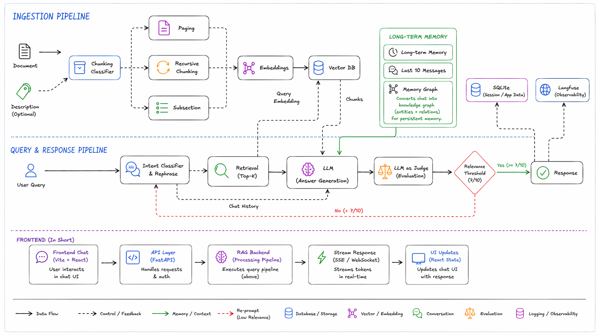
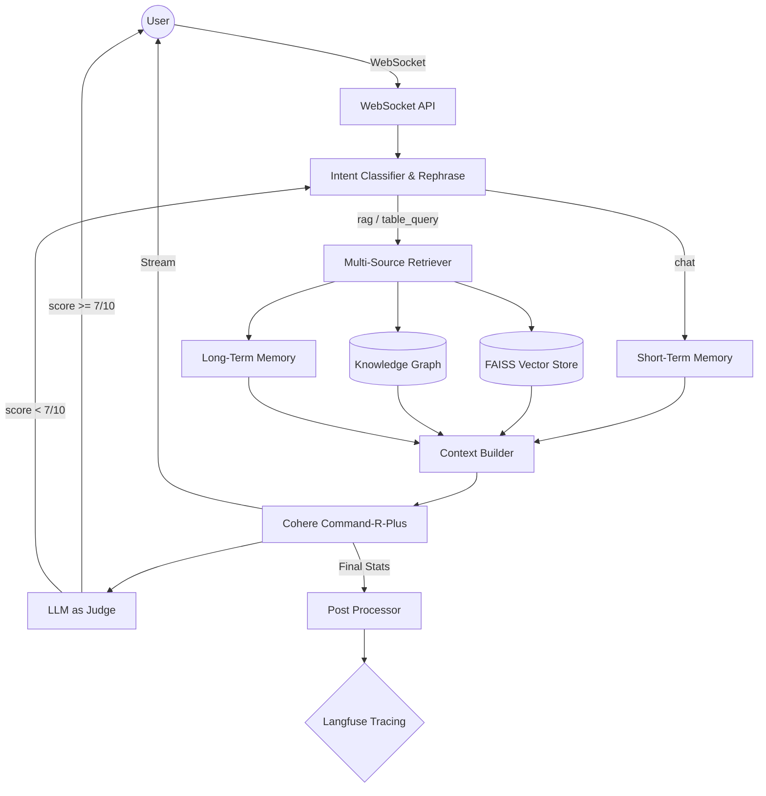

# MemGraph Backend Architecture

This document provides a technical deep-dive into the architecture of the MemGraph Document Assistant, organized by its three core pillars: **Dynamic Ingestion**, **Hybrid Memory**, and **Multi-Stage Retrieval**.

---

## System Architecture Diagram

The architecture is divided into three layers:

1. **Ingestion Pipeline** — converts raw documents into searchable, structured knowledge
2. **Query & Response Pipeline** — handles retrieval, generation, evaluation, and self-correction
3. **Frontend** — React + Vite chat UI communicating over WebSocket/SSE

---

## 1. Ingestion Pipeline

### Flow

1. **API Entry (`/api/sessions/{id}/upload`)**: Files are saved to local storage with metadata (optional user description).
2. **Chunking Classifier (`classifier.py`)**:
   - Uses **Cohere (Command-R-Plus)** to analyze a document preview + optional user description.
   - Selects the optimal strategy: `RecursiveTextSplitter` (generic), `Page` (visually heavy), or `Subsection` (hierarchical).
   - Defaults to **Recursive** when no description is provided to save latency.
3. **Partitioning (`ingest.py`)**: Uses **Unstructured.io** to extract text and HTML-formatted tables.
4. **Parallel Processing**:
   - **Text Pipeline**: Segments text per strategy and generates `1024-dim` embeddings via **Cohere (embed-english-v3.0)**.
   - **Table Pipeline**: Extracts tables as HTML/Markdown, generates a semantic summary, and embeds the summary while storing the raw Markdown.
5. **Persistence**:
   - **FAISS**: Stores embeddings in a FlatIP index for cosine similarity search.
   - **SQLite**: Stores chunk metadata, raw text, table Markdown, and ingestion status (`processing` → `completed`).

---

## 2. Hybrid Memory System

MemGraph uses a tiered memory architecture to maintain context across varied timescales.

### Components

| Layer | Storage | Description |
|---|---|---|
| **Short-Term Memory** | SQLite | Circular buffer of the last 10–15 messages for immediate conversational flow |
| **Long-Term Semantic Memory** | FAISS (`__memory__` namespace) | Semantically indexed insights and user preferences, retrieved when relevant |
| **Knowledge Graph (Triples)** | NetworkX | Entities and relationships extracted as Subject → Predicate → Object triples for multi-hop reasoning |
| **Event Memory** | SQLite | Timeline-based store tracking system events and document updates |

The Knowledge Graph is the core differentiator — it converts conversations into structured triples, enabling the system to reason across documents and sessions rather than relying on lossy summarization.

---

## 3. Query & Response Pipeline

### The 4-Step Process

1. **Intent Classifier & Rephrase (`intent.py`)**:
   - Classifies queries into `chat`, `rag`, `table_query`, `summarize`, or `follow_up`.
   - **Fast-Path**: Common greetings skip RAG entirely to prevent irrelevant document summaries.
   - For `follow_up` queries, an LLM rewrites them into standalone search queries using recent chat history.

2. **Retrieval — Top-K (`retriever.py`)**:
   - Parallel search across **FAISS** (text + tables), **Knowledge Graph**, and **Long-Term Memory**.
   - All results filtered by `session_id` for strict data isolation.

3. **LLM Answer Generation**:
   - **Cohere Command-R-Plus** via LangChain, streamed as tokens over **WebSocket** for low perceived latency.
   - Context window capped at **3,500 tokens** — prioritizes retrieved chunks, then recent history.
   - Citation injection matches generated text against source metadata: `[Source: paper.pdf, page 5]`.

4. **LLM as Judge (Evaluation)**:
   - Scores the generated response on relevance and grounding (0–10 scale).
   - **Relevance Threshold (7/10)**: Responses scoring ≥ 7 are returned directly.
   - Responses scoring < 7 trigger a **re-prompt / refine query** loop back to the Intent Classifier.

### Data Flow

---

## 4. Frontend Layer

The frontend communicates with the backend over **WebSocket** (chat) and **SSE** (ingestion progress).

| Component | Tech | Role |
|---|---|---|
| Chat UI | React 18 + Vite | User interaction, message rendering, session management |
| API Layer | FastAPI | Handles HTTP requests, auth, and WebSocket upgrades |
| RAG Backend | Processing pipeline | Executes the full query pipeline above |
| Stream Response | SSE / WebSocket | Streams tokens in real-time to the UI |
| UI State | React + Zustand | Updates chat view with streamed response and stats |

---

## 5. Observability

Integrated with **Langfuse** for end-to-end tracing across all pipeline stages:

| Stage | What's Traced |
|---|---|
| Ingestion | Chunk counts, table counts, total processing latency |
| Retrieval | Query latency, source quality scores |
| Chat | Full conversation traces, input/output token counts, model cost |

---

## Tech Stack Summary

| Layer | Technologies |
|---|---|
| LLM & Embeddings | Cohere Command-R-Plus, Command-R, embed-english-v3.0 |
| Vector Store | FAISS (FlatIP, cosine similarity) |
| Knowledge Graph | NetworkX |
| Metadata & Sessions | SQLite |
| Backend Framework | FastAPI, LangChain |
| Document Parsing | Unstructured.io |
| Frontend | React 18, Vite, TailwindCSS, Zustand |
| Observability | Langfuse |
